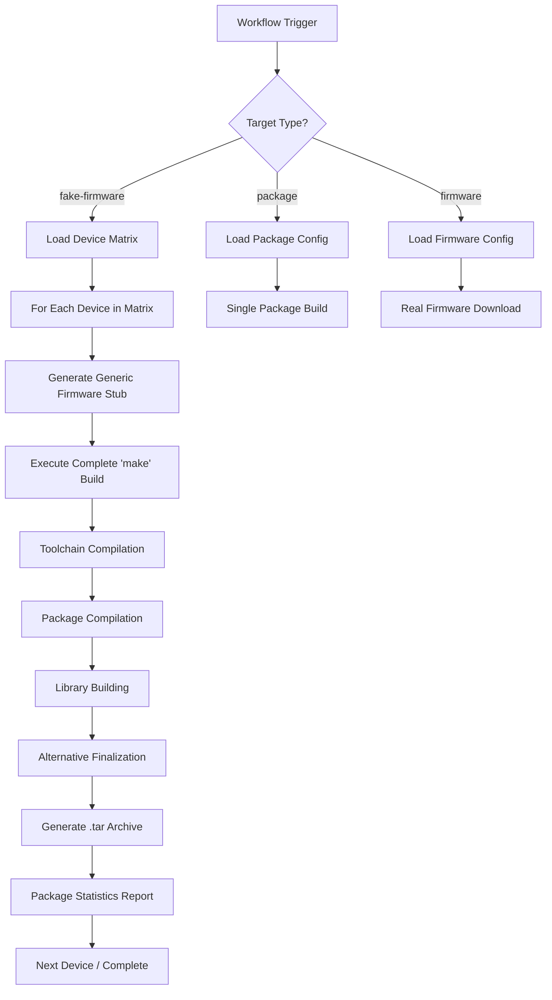

# Freetz-NG Build Guide


This document provides guidance for building the complete Freetz-NG framework as well as single packages.

Freetz-NG provides a comprehensive testing framework that combines local development capabilities with automated validation across multiple platforms. Understanding both approaches is crucial for effective package and firmware build, testing and development.

## Overview

When building the firmware, testing the build procedure, developing packages or modifying configurations, you'll first work directly on your development machine. This local testing phase allows you to compile packages, build firmware images, and test them on devices you physically own. It's the foundation of the test and development process, where you can quickly iterate, debug issues, and verify that your changes work as expected. Local testing gives you full control over the build environment and immediate access to debugging tools.

While local testing ensures your changes work on your specific setup, Freetz-NG's ecosystem spans approximately tens of different device models, each with unique hardware characteristics, firmware versions, and toolchain requirements. To ensure compatibility across this diverse ecosystem, Freetz-NG uses GitHub Actions workflows that automatically test your changes across all supported platforms. This automated testing catches platform-specific issues that might not appear in your local environment and provides confidence that your modifications work consistently across the entire Freetz-NG user base.

This guide first explains the local build system, then covers automated workflow testing to provide a complete testing strategy.

------------------

## Understanding Freetz-NG Build System

We will now understand the main parameters offered by Freetz-NG's `make` command.

The simplest way to use `make` is through the following commands:

```bash
make menuconfig  # configure your Freetz-NG firmware build options (device, packages, toolchain, etc.)
make  # build the firmware
```

The following two paragraphs better explain the above commands.

### `make menuconfig`

This is Freetz-NG's implementation of the [Kconfig](https://docs.kernel.org/kbuild/kconfig-language.html) system (derived from Linux kernel configuration tools). It provides an interactive menu-driven [Ncurses](https://en.wikipedia.org/wiki/Ncurses) textual user interface for configuring the firmware build options. It generates the `.config` file that serves as the authoritative configuration for the subsequent `make`.

**What it does:**
- Displays a hierarchical menu structure based on `Config.in` files
- Allows users to select/deselect packages, libraries, kernel options, and device-specific features
- Generates the `.config` file that serves as the authoritative configuration for subsequent builds

**Key files involved:**
- `Config.in` - Main configuration skeleton written in Kconfig language
- `.config` - User-generated configuration file (should not be edited manually)

#### User Competence Levels

Freetz-NG's menuconfig introduces a progressive disclosure model through user competence levels, which controls the visibility of configuration options based on the user's expertise. This design philosophy keeps the interface manageable for newcomers while providing full access to advanced features for experienced users.

The **Beginner** level is the default setting, offering a curated selection of well-tested packages and straightforward configuration options. At this level, the menu structure remains clean and focused on the most commonly needed features, reducing the risk of misconfiguration for users who are new to firmware modification.

The **Expert** level unlocks several advanced configuration categories. Users at this level gain access to the BusyBox applets menu, allowing fine-grained control over which shell utilities are included in the firmware. The shared libraries menu becomes visible, enabling selection of additional runtime libraries that packages may depend upon. Toolchain configuration options appear, providing the ability to override firmware source locations and compiler settings. Kernel modules selection is exposed, allowing addition of extra kernel functionality. Additionally, various firmware-specific options and hardware-level configuration become accessible.

The **Developer** level is intended for Freetz-NG contributors and advanced users who need access to unstable or experimental features. This level exposes packages that are still under development or not yet thoroughly tested across all device models. A prominent warning is displayed when selecting this level to remind users that Developer features may be unstable or cause issues.

When writing test configurations or creating packages, understanding these levels is important for setting appropriate visibility. Packages and options that require advanced knowledge or may cause issues if misconfigured should be gated behind `FREETZ_SHOW_EXPERT` or `FREETZ_SHOW_DEVELOPER` dependencies in their `Config.in` files.

#### Externalization

FRITZ!Box devices have limited internal flash storage, and as you add more packages to your firmware, you may encounter the "Filesystem image too big" error during the build process. Freetz-NG addresses this constraint through a feature called externalization, which allows you to move selected packages, libraries, and files from the internal flash to external storage media.

For devices with USB host capability, the solution is using a USB storage device (flash drive, external hard drive, or SSD). The externalized components are stored on this device and loaded into the system at boot time.

The externalization system works by creating two output files during the build process instead of one. The standard `.image` file contains the core firmware with essential components, while a companion `.external` file (a compressed tar archive) contains all the externalized packages and libraries. Both files are placed in the `images/` directory and share the same base filename.

For deployment, several methods are available depending on your situation. The most common approach is using the Freetz web interface: flash the `.image` file through the standard firmware update process, then upload the `.external` file under System → Firmware-Update using the "external file upload" option. The web interface automatically extracts the archive to the designated external storage location.

For initial installations or recovery scenarios, the `tools/push_firmware` script can flash the `.image` file directly through the bootloader via FTP. However, this method only installs the core firmware. It cannot upload the `.external` file since the Freetz-NG system is not yet running.

Once the device boots with Freetz-NG installed, you can deploy the external components through the web interface under System → Firmware-Update using the "external file upload" option. Alternatively, the `tools/ssh_firmware_update.py` script provides a more powerful solution: running it with `--host <ip> --password <password> --batch` performs a complete unattended update of both the firmware image and the external file, making it ideal for interactive or unattended updates, or automated deployment workflows.

When selecting components for externalization in menuconfig (under Advanced Options → External), you can choose from two categories: packages (binary programs and their associated files) and libraries (shared runtime libraries). Libraries require careful consideration of dependencies: any program linked against an externalized library won't function until that library is loaded from external storage.

For systems that will run database applications or services with heavy disk I/O, using an SSD or traditional hard drive is strongly recommended over SD cards or low-quality USB flash drives, which may fail under sustained write operations.

### `make` (without arguments)

This is the main build command that compiles the complete firmware image based on the configuration in `.config`.

**What it does:**
- Downloads required source packages and firmware files
- Builds the cross-compilation toolchain (GCC, binutils, etc.)
- Compiles selected packages and libraries
- Creates the final firmware image (`.image` file)
- Generates build artifacts in the `images/` directory

**Build process overview:**
1. **Preparation**: Downloads and extracts source packages
2. **Toolchain**: Builds cross-compilation tools for target architecture
3. **Kernel**: Compiles kernel modules and headers
4. **Packages**: Builds user-space applications and libraries
5. **Image creation**: Assembles final firmware using `fwmod`

Since `make` is the primary build tool that downloads, compiles everything, and creates the firmware (potentially taking many hours), several complementary tools and targets are available for development and testing workflows. The `tools/genin` utility validates package configurations, while `make olddefconfig` updates existing configurations to match current menu structures. The `make help` target provides a comprehensive list of available make arguments. The following sections explore this options, as well as cleaning targets for managing previous compilations and package-specific targets for testing individual components.

#### tools/genin

This is a validation tool that checks the consistency of package configurations.

**What it does:**
- Parses all `Config.in` files in the package directories
- Validates menu structure and dependencies
- Should return no errors if package configurations are properly set up
- Helps catch configuration issues before attempting builds

**Usage:**
```bash
tools/genin
```

If `tools/genin` returns errors, it indicates problems with package configuration files that need to be fixed before building.

#### make olddefconfig

This target updates an existing `.config` file to match the current menu structure, setting any new options to their default values.

**What it does:**
- Takes an existing `.config` file as input
- Adds any new configuration options that have been added to `Config.in` files
- Sets new options to their default values (usually 'n' for packages)
- Maintains existing user selections
- Updates dependencies and selects based on current menu logic

**When to use:**
- After pulling updates that add new configuration options
- When switching between different branches with different menu structures
- To ensure `.config` is compatible with current codebase

**Related targets:**
- `make oldconfig` - Interactive version that prompts for new options
- `make silentoldconfig` - Non-interactive version (same as olddefconfig)
- `make defconfig` - Creates new config with all defaults

#### make help

This target displays a summary of all available make targets and their descriptions.

**What it shows:**
- Package-specific targets (compile, clean, dirclean, etc.)
- Global build targets (menuconfig, firmware, etc.)
- Development and debugging targets
- Tool-related targets

**Usage:**
```bash
make help
```

This is useful for discovering available build options and understanding the build system capabilities.

### Make Clean Targets

When you want to restart the build process from scratch, you need to use `make dirclean`. However, Freetz-NG provides several cleaning options with different scopes:

#### make cacheclean

**What it does:**
- Removes small cached files and directories
- Cleans temporary configuration files (`.config.*.tmp`, `.config.old`, `.config.compressed`)
- Removes generated Config.in files (`make/pkgs/Config.in.generated`, `make/pkgs/external.in.generated`)
- Cleans build directory (`$(BUILD_DIR)`)
- Removes fakeroot cache directory
- Removes detected firmware images in download directory
- Runs custom fwmod cleanup scripts

**Scope:** Minimal cleanup, preserves source code and compiled packages
**Use when:** You want to refresh caches and temporary files without rebuilding everything

#### make clean

**What it does:**
- Everything that `cacheclean` does
- Additionally cleans tools (host tools, cross-compilation tools)

**Scope:** Cache cleanup + tools cleanup
**Relationship:** `clean` ⊃ `cacheclean` (clean is a superset of cacheclean)
**Use when:** You want to recompile tools but keep source code and packages

#### make dirclean

**What it does:**
- Everything that `clean` does
- Additionally removes:
  - Package build directories (`$(PACKAGES_DIR)`)
  - Source code directories (`$(SOURCE_DIR)`)
  - Target toolchain directory (`$(TARGET_TOOLCHAIN_DIR)`)
  - Kernel build directory (if `.config` exists)

**Scope:** Complete source cleanup except tools and configuration
**Relationship:** `dirclean` ⊃ `clean` ⊃ `cacheclean`
**Use when:** You want to restart compilation from scratch, forcing re-download and re-extraction of sources

#### make distclean

**What it does:**
- Everything that `dirclean` does
- Additionally removes:
  - Configuration files (`.config.cmd`, `.tmpconfig.h`)
  - Include config directory (`$(INCLUDE_DIR)/config`)
  - Firmware images directory (`$(FW_IMAGES_DIR)`)
  - Kernel target directory (`$(KERNEL_TARGET_DIR)`)
  - All package and source directories
  - Toolchain directory (`$(TOOLCHAIN_DIR)`)
  - Tools build directory (`$(TOOLS_BUILD_DIR)`)

**Scope:** Complete cleanup except download directory
**Relationship:** `distclean` ⊃ `dirclean` ⊃ `clean` ⊃ `cacheclean`
**Use when:** You want a completely fresh environment, equivalent to a fresh checkout
**Note:** Preserves `.config`, `config/custom.in`, `.fwmod_custom`, and download directory (`~/.freetz-dl/`)

#### Quick Reference

| Target | Removes Sources | Removes Tools | Removes Config | Preserves |
|--------|----------------|---------------|----------------|-----------|
| `cacheclean` | ❌ | ❌ | Temp files only | Sources, packages, tools |
| `clean` | ❌ | ✅ | Temp files only | Sources, packages |
| `dirclean` | ✅ | ✅ | Temp files only | `.config`, downloads |
| `distclean` | ✅ | ✅ | ✅ | Downloads only |

**Recommendation:** Use `dirclean` for most rebuild scenarios. Use `distclean` only when you want to start completely fresh.

### Menuconfig Maintenance - Technical Notes

#### Configuration File Properties
- `.config` serves as the authoritative configuration file for all build processes
- Manual editing is not recommended; always use `make menuconfig`
- File is copied to `/etc/.config` in final firmware (unless disabled in menuconfig)
- Primary debugging resource for configuration-related user issues

#### Dependency Warning Analysis
Configuration save operations may produce warnings such as:
```
warning: (FREETZ_PACKAGE_AUTOFS_NFS && FREETZ_PACKAGE_NFSROOT) selects FREETZ_MODULE_nfs which has unmet direct dependencies (FREETZ_KERNEL_VERSION_2_6_13_1 || FREETZ_KERNEL_VERSION_2_6_28 || FREETZ_KERNEL_VERSION_2_6_32)
```

**Interpretation:**
- Package selection requires kernel module support unavailable in current kernel version
- Resolution options: update kernel dependencies or disable package for incompatible kernels

#### Remove-Patch Configuration Pattern
For remove-patches (AVM feature removal), implement this dependency structure:

```
FREETZ_PACKAGE_FOO
    select FREETZ_REMOVE_MY_FEATURE if FREETZ_HAS_AVM_MY_FEATURE

FREETZ_REMOVE_MY_FEATURE
    depends on FREETZ_HAS_AVM_MY_FEATURE

FREETZ_HAS_AVM_MY_FEATURE
    depends on FREETZ_TYPE_A || FREETZ_TYPE_B || ...
```

**Purpose:** Ensures remove-patches are selectable only when AVM feature exists on target device.

#### Syntax Error Diagnostics
When `make menuconfig` reports syntax errors:

**Cache-enabled diagnosis:**
- Examine line number in `Config.in.cache`
- Search backwards for `INCLUDE_BEGIN` to identify source file

**Cache-disabled diagnosis:**
- Execute `make menuconfig-nocache` for precise file and line error location

### Configuration Maintenance Procedures
- Execute `tools/genin` after `Config.in` file modifications to validate syntax
- Run `make olddefconfig` post-update to process new configuration options
- Validate configurations across multiple device types to detect dependency conflicts
- Document hardware/firmware-specific features with appropriate dependency declarations

### Troubleshooting Build Failures

Build processes can fail due to various reasons, including network issues, resource constraints, or configuration errors. Here are best practices for handling common failures:

#### Network and Download Errors
If `make` fails during the download phase (e.g., "curl: (56) Failure when receiving data" or "wget: unable to resolve host"), it may be a temporary network issue:
- **Check connectivity**: Ensure stable internet access and retry `make`.
- **Retry the build**: Most download failures are transient; relaunching `make` often succeeds on the second attempt.
- **Inspect logs**: Look for messages like "Download failed" in the output. If persistent, check firewall settings or proxy configurations.

#### Resource Constraints
Builds require significant CPU, memory, and disk space. Errors like "No space left on device" or out-of-memory kills indicate resource issues:
- **Free disk space**: Ensure at least 20-50 GB free space. Use `df -h` to check and clean up if needed.
- **Monitor resources**: Use `top` or `htop` during build to watch for memory/CPU bottlenecks.
- **Reduce parallelism**: If using `-j` flag, lower the job count (e.g., `make -j4` instead of `-j8`).

#### Workflow Job Failures
In automated GitHub Actions workflows, jobs may fail due to temporary issues:
- **Rerun failed jobs**: Use the "Re-run failed jobs" button in GitHub Actions if failures are due to download timeouts or "No space left on device" in cloud runners.
- **Check logs**: Review job logs for patterns like network errors or resource exhaustion. Persistent failures may indicate code issues.

**General Tips**:
- Always run `make dirclean` before retrying major failures to ensure a clean state.
- For complex issues, check the Freetz-NG GitHub issues or discussions for similar problems.
- If builds consistently fail, verify your environment matches the prerequisites in `docs/PREREQUISITES`.

## Host Tools

Freetz-NG uses host tools to support the cross-compilation process. These are essential because some commands need to be executed on the host during the firmware build for embedded targets. The list of host tools is available at [https://freetz-ng.github.io/freetz-ng/host-tools](https://freetz-ng.github.io/freetz-ng/host-tools).

Host tools are utilities compiled for the host system (your development machine) that assist in building firmware for embedded targets. They include build tools, compression utilities, file system tools, and other binaries required during the compilation process. Each host tool has its own documentation page with version information, homepage, repository, and maintainer details.

Host tools are independent of the target firmware versions; they are designed to run on the host and do not interact directly with the embedded system's software stack. This ensures that host tools can be reused across different firmware builds without version conflicts related to the target.

They are built with:

- `make tools` - Builds the tools required by current selection
- `make tools-all` - Builds all available tools of Freetz
- `make tools-allexcept-local` - Builds all non-local tools of Freetz (dl-tools)
- `make tools-push_firmware` - Builds the tools required by push_firmware
- `make tools-dirclean` - Cleans everything of all Freetz tools
- `make tools-distclean-local` - Cleans everything of local tools (dl-tools)
- `make <tool>-host-precompiled` - Builds a specific tool using precompiled binaries if available

Freetz-NG uses GNU Make to manage package dependencies and host tools in a modular way. Host tools are typically built first via `make host-tools-precompiled`, followed by target packages. Dependencies are checked recursively. However, only file existence is verified (version mismatches are not automatically detected). If a dependency is missing, the build fails; otherwise, existing binaries are reused.

Built host tools are cached in `tools/build`, `tools/build/usr/bin/` to avoid redundant rebuilds. The cache persists across builds, but can be invalidated manually (e.g., `make tool-host-dirclean` removes build directories and binaries). The cache is shared across packages.

To reduce the build time of host tools, Freetz-NG supports downloading precompiled host tools from a cloud repository. Freetz-NG uses a shared cache hosted on GitHub at [https://github.com/Freetz-NG/dl-mirror/releases/](https://github.com/Freetz-NG/dl-mirror/releases/). The cache is updated by the Freetz-NG team, who periodically release precompiled archives of host tools (e.g., `tools-VERSION.tar.xz`) for common architectures. Source archives are stored in the `dl` directory. Precompiled binaries are extracted directly to `tools/build`, bypassing local compilation when available.

Specifically, Host tools are compiled locally from source (downloaded to `dl`) when:
- The build directory is clean (e.g., after make tool-host-dirclean).
- The build is forced (e.g., via `make tool-host-precompiled` after cleaning).
- No precompiled version is available or selected, and the target is invoked.

The `dl` directory is preserved by `make dirclean` and `make distclean`. To remove its contents manually if needed, use `rm -rf dl/*`.

During the build process, if the configuration option `FREETZ_HOSTTOOLS_DOWNLOAD` is enabled (which is the default), the system checks if the required host tools archive is available in the cache based on its version and the related SHA256 hash. If the archive is present and matches the expected hash, it is downloaded and extracted for use; otherwise, the tools are compiled locally from source. If `FREETZ_HOSTTOOLS_DOWNLOAD` is disabled, the build always compiles the tools locally, which is useful for incompatible systems or custom modifications.

The Freetz build system only checks for binary existence, not version compatibility. This process ensures efficient builds (but requires manual intervention for version issues).

## Package-Specific Make Targets

As mentioned in a previous paragraph, Freetz-NG provides specific make targets for individual packages in order to speed-up verification on a specific development. Each package supports several build operations with convenient shortcuts that combine multiple steps.

For example, the `-recompile` target is equivalent to running `-dirclean` followed by `-precompiled` - both achieve a complete clean rebuild.

Throughout this section, we use the `bzip2` package as an example. To work with other packages, simply replace `bzip2` with the desired package name (which corresponds to the package's `.mk` filename in `make/pkgs/`).

For example, to work with the PHP package, you would use `php` (from `make/pkgs/php/php.mk`), or for OpenSSL you would use `openssl` (from `make/pkgs/openssl/openssl.mk`).

Here are the main target patterns:

### `make bzip2-clean`

**What it does:**
- Removes only compiled files and build artifacts
- Preserves downloaded and extracted source code
- Keeps local source code modifications

**Use when:** You want to recompile without re-downloading everything, maintaining local source changes

### `make bzip2-dirclean`

**What it does:**
- Completely removes the package build directory (`$(BZIP2_DIR)`) and target directory
- `bzip2-dirclean` is a superset of `bzip2-clean` - it includes everything `bzip2-clean` does plus more
- Forces complete re-download and re-extraction of sources

**Use when:** You want to restart compilation from scratch, forcing re-download and complete recompilation

**Relationship:** `bzip2-dirclean` ⊃ `bzip2-clean`

### `make bzip2-precompiled`

**What it does:**
- Compiles and installs the package in the target directory, making it ready for firmware inclusion
- Main target for compiling the package
- Includes automatic dependencies based on configuration (e.g., library if `FREETZ_LIB_libbz2=y`)

**Use when:** Standard package compilation with dependency resolution

### `make bzip2-recompile`

**What it does:**
- Combination of `dirclean` + `precompiled` - removes everything and recompiles from scratch
- Ensures completely clean compilation

**Use when:** You want to be sure of a completely clean build, useful after significant configuration changes or code modifications

### General Package Target Patterns

All packages support these target suffixes:

| Suffix | Description | Use Case |
|--------|-------------|----------|
| `-clean` | Remove build artifacts, keep sources | Quick rebuild |
| `-dirclean` | Remove build directory and sources | Full rebuild |
| `-precompiled` | Standard compilation with dependencies | Normal build |
| `-recompile` | Clean + recompile from scratch | Clean build |

**Examples:**
```bash
# Clean rebuild of bzip2
make bzip2-clean bzip2-precompiled

# Full rebuild of bzip2
make bzip2-dirclean bzip2-precompiled

# Or simply:
make bzip2-recompile

# Multiple packages
make bzip2-recompile patchelf-recompile
```

------------------

## Local vs. Workflow-Based Testing

Freetz-NG supports two main approaches for testing packages and firmware builds:

### Local Testing (Understanding Freetz-NG Build System)
The previous section explains how to compile the system or individual packages directly on your local machine. This approach is essential for:
- Initial development and debugging
- Testing on devices you physically own
- Quick iteration during package development
- Understanding the build process in detail

### Workflow-Based Testing (make_package.yml)
The following section describes automated testing using GitHub Actions workflows. This approach is crucial for:
- Testing across multiple device/toolchain combinations simultaneously
- Ensuring compatibility across the entire Freetz-NG ecosystem
- Automated regression testing
- CI/CD integration

Freetz-NG uses GitHub Actions workflows to automate testing across the entire device and firmware matrix, referring to a predefined list of supported combinations of device models (e.g., 7270_V1, 7390) and firmware versions (e.g., 04_XX, 06_0X). Freetz-NG supports a wide range of AVM Fritz!Box devices and firmware versions. This matrix ensures that Freetz-NG can be built and tested across diverse hardware and software configurations, covering tens of different device models with unique characteristics.

The matrix is embedded in the build system and can be manually extracted using the following command:

```bash
sed -n 's/FREETZ_TYPE_//; s/FREETZ_TYPE_FIRMWARE_//; s/.* && dltc "\(.*\)".*/\1/p' tools/dl-toolchains_make
```

This command parses the `tools/dl-toolchains_make` script and outputs pairs like:

```
WLAN        04_XX
7270_V1     04_XX  FREETZ_TARGET_IPV6_SUPPORT
7270_V3     06_0X
...
```

Each line represents a supported combination, where the first column is the device model, the second is the firmware version, and additional flags (like `FREETZ_TARGET_IPV6_SUPPORT`) indicate special features or requirements.

The following Python program allows mapping a device model to a device code as well as the firware versions.

```python
import kconfiglib

def get_prompt(sym):
    if sym.nodes and sym.nodes[0].prompt:
        prompt = sym.nodes[0].prompt
        return prompt[0] if isinstance(prompt, tuple) else prompt
    return None

kconf = kconfiglib.Kconfig("config/.cache.in", warn=False)

print("=== Device Types Mapping ===")
for sym in kconf.unique_defined_syms:
    if sym.name.startswith("FREETZ_TYPE_") and not sym.name.startswith("FREETZ_TYPE_FIRMWARE_"):
        model = get_prompt(sym)
        if model:
            code = sym.name.replace("FREETZ_TYPE_", "")
            print(f"{model} -> {code}")

print("\n=== Firmware Versions Mapping ===")
for sym in kconf.unique_defined_syms:
    if sym.name.startswith("FREETZ_TYPE_FIRMWARE_"):
        fw = get_prompt(sym)
        if fw:
            code = sym.name.replace("FREETZ_TYPE_FIRMWARE_", "")
            print(f"{fw} -> {code}")
```

The program reads `config/.cache.in`, which is generated by `make menuconfig`, or `make olddefconfig`.

The output is similar to the following:

```
=== Device Types Mapping ===
...
Speedport W501V -> W501V
...
7530 -> 7530_W5
7530 AX -> 7530_W6_V1
7530 AX B - UNTESTED -> 7530_W6_V2
...
=== Firmware Versions Mapping ===
FRITZ!OS 04.00+ -> 04_XX
FRITZ!OS 05.20+ -> 05_2X
FRITZ!OS 05.50+ -> 05_5X
...
```

The workflow follows a structured process:

1. **Parse-Matrix**: The first job parses the matrix from the build scripts to generate a list of all device-firmware combinations to test.

2. **Parallel Jobs**: For each combination in the matrix, a separate job runs in parallel. Each job:
   - Configures the build environment for the specific device and firmware.
   - Downloads and compiles the necessary components.
   - Builds the firmware image.
   - Performs basic validation (e.g., checks for build errors, image size).

3. **Configuration Analysis**: After all parallel jobs complete, a final analysis job reviews the results across all combinations. This includes:
   - Aggregating build logs and errors.
   - Checking for configuration conflicts or missing dependencies.
   - Generating reports on compatibility and potential issues.

This automated workflow ensures that changes to Freetz-NG are validated across the full ecosystem, catching platform-specific issues that local testing might miss.

## `make_package.yml` workflow

This section explains how to use GitHub Actions workflows for comprehensive automated testing. Workflows provide significant advantages over local testing alone:

### Why Use GitHub Actions Workflows?

GitHub Actions workflows automate the build process in isolated environments, allowing you to:

1. **Test Multiple Configurations Simultaneously**: Instead of testing on just one device, workflows can test across dozens of device/firmware/toolchain combinations in parallel
2. **Ensure Ecosystem Compatibility**: Freetz-NG supports approximately 30 pre-configured devices with different hardware capabilities and firmware versions
3. **Catch Platform-Specific Issues**: Different devices may have unique kernel versions, toolchain requirements, or hardware-specific code that needs validation
4. **Automate Regression Testing**: Workflows can run automatically on code changes, catching issues before they reach users

### The Testing Workflow

A typical testing process follows this progression:

1. **Local Testing**: Start by testing on devices you physically own and can access for debugging
2. **Device-Specific Testing**: Test on specific device configurations you're targeting
3. **Comprehensive Workflow Testing**: Use GitHub Actions to verify compilation across all supported devices and toolchains

This multi-stage approach ensures both thorough testing and efficient development workflows.

### Workflow Architecture

The `make_package.yml` workflow uses a matrix strategy to test packages across multiple dimensions:

#### What are GitHub Actions Workflows?

GitHub Actions workflows are automated processes that run on GitHub's infrastructure. For Freetz-NG, they provide:

- **Isolated Build Environments**: Each test runs in a clean Ubuntu environment with no interference from local machine state
- **Parallel Execution**: Multiple device/toolchain combinations can be tested simultaneously
- **Version Control Integration**: Workflows can trigger automatically on pull requests, pushes, or scheduled intervals
- **Artifact Storage**: Build outputs can be stored and downloaded for further analysis

#### Pre-configured Devices and Toolchains

Freetz-NG comes with approximately 30 pre-configured device profiles, each representing different:

- **Hardware Platforms**: Different router models (7590, 7530, 7490, etc.)
- **Firmware Versions**: Various AVM firmware releases (08.0X, 08.2X, 08.3X, etc.)
- **Kernel Versions**: Different Linux kernel versions with varying feature sets
- **Toolchain Configurations**: GCC versions, optimization flags, and architecture-specific settings

Additional device configurations can be added manually by modifying the workflow matrix or using the `custom_config` parameter.

#### The Complete Testing Process

A comprehensive testing approach follows this sequence:

1. **Local Development Testing**:
   - Test on devices you physically own
   - Use local build system for quick iteration
   - Debug issues directly on target hardware

2. **Device-Specific Testing**:
   - Test on specific device models you're targeting
   - Verify functionality on particular firmware versions
   - Check hardware-specific features

3. **Workflow-Based Comprehensive Testing**:
   - Use GitHub Actions to test across all supported devices
   - Catch platform-specific compilation issues
   - Ensure compatibility across the entire ecosystem
   - Generate reports for all device combinations

This multi-layered approach ensures both development efficiency and ecosystem-wide compatibility.

**Purpose**: Comprehensive testing of packages and firmware builds across multiple toolchain configurations using a matrix build strategy. Supports both individual package testing and full firmware builds.

**Parameters**:

| Parameter | Type | Required | Default | Description |
|-----------|------|----------|---------|-------------|
| `make_target` | string | No | `""` | Make target: `'pkg1,pkg2'`, `'package-precompiled'`, `'package-recompile'`, `'firmware'`, `'-firmware'`, `'fake-firmware'`, `'libs'`, `'=package'`, or `'pkg-firmware'`, `'pkg-recompile-firmware'`, `'pkg-precompiled-firmware'` (builds firmware and the specified package, gh param: -f make_target=php). Supports multiple packages separated by commas (e.g., `'php,openssl'`). Supports custom labels using `#` syntax (e.g., `'php#Test PHP 8.4'` or `'php # Test PHP 8.4'`) to customize the workflow run name. Spaces before and after `#` are optional and ignored |
| `url` | string | No | `""` | URL of config file (.tar, .tgz, .tbz, .config) or empty to use `secrets.ACTIONS_TESTER` |
| `verbosity` | choice | No | `"0"` | Build verbosity level: `0`=quiet, `1`=normal, `2`=verbose |
| `download_toolchain` | boolean | No | `false` | Try to download precompiled toolchain (may fail without AVX2 support) |
| `download_hosttools` | boolean | No | `false` | Try to download precompiled host tools |
| `cancel_previous` | boolean | No | `true` | Cancel previous runs of this workflow |
| `use_queue` | boolean | No | `true` | Use workflow queue to prevent concurrent runs |
| `custom_config` | string | No | `""` | Custom device/firmware/language (e.g., `'7530_W6_V1 08_2X EN'` or `'7590 08_0X'` or just `'7530'`, separators: space/tab/comma/semicolon/pipe/dash). Supports multiple configurations separated by commas (e.g., `'7590_W6 08_2X DE,7530_W5 08_0X EN'`). When used with `-firmware` target, can specify custom pre-build commands to execute before firmware build (e.g., `'make python3-host-dirclean && make python3-host-precompiled'`) |
| `add_or_override` | choice | No | `"add"` | Add custom config to matrix or override with only custom configuration |
| `create_artifacts` | boolean | No | `false` | Create and upload build artifacts |

**Matrix Strategy**:
- Tests packages across all available toolchains (when `add_or_override="add"` or no overrides)
- Tests only custom configuration (when `add_or_override="override"`)
- Maximum 16 parallel jobs

**Target Suffixes**:
- `package` → `-precompiled` (default)
- `package-precompiled` → Compile precompiled package
- `package-recompile` → Force recompilation from source
- `firmware` → Build complete firmware image
- `-firmware` → Build firmware with native .config (no modifications, uses configuration as-is)
- `fake-firmware` → Generate fake firmware for testing device configuration
- `package-firmware` → Build firmware and the specified package
- `package-recompile-firmware` → Build firmware and force recompilation of the specified package
- `package-precompiled-firmware` → Build firmware and compile precompiled package
- `libs` → Build only libraries
- `=package` → Build package skipping library dependencies

**Special Packages**:
- `firmware` → Build complete firmware image instead of package
- `-firmware` → Build firmware with native .config (no modifications, preserves configuration exactly as downloaded/loaded)
- `fake-firmware` → Generate fake firmware structure for testing device configuration (no real firmware download required)
- `libs` → Build only libraries
- `=package` → Build package skipping library dependencies

## Detailed Parameter Explanations

### make_target Options

#### Multiple Packages
You can compile multiple packages by listing them separated by commas. For example, `make_target="php,openssl,libxml2"` will build each package sequentially across all configured toolchains. This is useful for testing interdependent packages or validating that a set of packages compiles successfully together.

#### Skipping Library Dependencies (=package)
The `=package` syntax (e.g., `=php`) builds a package while skipping its library dependencies. This is implemented by setting `skip_libs="true"` in the workflow matrix.

**Pros:**
- Faster build times since libraries are not rebuilt
- Useful for testing package compilation when you know libraries are already available or compatible
- Reduces resource usage in CI/CD environments
- Allows focused testing of package-specific code changes

**Cons:**
- May fail if required libraries are missing or incompatible
- Doesn't validate the complete dependency chain
- Not suitable for packages with complex or version-specific library requirements
- Can mask issues with library integration

Use this option when you need quick package validation and are confident about library compatibility, but prefer full builds for comprehensive testing.

#### Building Only Libraries (libs)
The `make_target="libs"` option builds only the shared libraries without any packages. This is particularly useful in the following scenarios:

- Validating library compilation across multiple toolchains
- Testing library updates or patches before building dependent packages
- Pre-building libraries for subsequent package builds in multi-stage workflows
- Debugging library-specific compilation issues
- Ensuring library compatibility with different GCC versions or architectures

This target executes `make libs` and is ideal for isolating library-related problems or ensuring libraries are ready before package builds.

#### Firmware Build Options
- `firmware`: Builds a complete firmware image using the standard workflow configuration modifications
- `-firmware`: Builds firmware preserving the `.config` file exactly as downloaded or from `myconfig` (no workflow modifications). This requires providing a configuration file via `url` parameter or having a `.github/workflows/myconfig` file. This is useful for testing custom configurations without workflow alterations, CI/CD testing of exact configuration files, and executing custom pre-build commands
- `fake-firmware`: Creates a complete build process without downloading real AVM firmware, useful for testing device configurations when firmware is unavailable, validating build system configuration, and CI/CD testing without large downloads

#### Single Package Builds
When building a single package (e.g., `make_target="php"`), no configuration file is required. The workflow automatically generates a default `.config` file using `make olddefconfig` and enables the specified package. This simplifies testing by eliminating the need to create or maintain configuration files for individual package validation.

In the build output, you'll typically see two phases:
- **"Building library dependencies for package"**: This builds all required shared libraries first
- **"Building package"**: This compiles the actual package using the pre-built libraries

When using `=package` (skip libraries), only the second phase occurs. When using `make_target="libs"`, only the first phase occurs (building libraries only).

### custom_config Parameter

The `custom_config` parameter allows specifying custom device/firmware/language combinations for testing. It supports flexible syntax with multiple separators (space, tab, comma, semicolon, pipe, dash) and can define multiple configurations separated by commas.

**Single Configuration Examples:**
- `custom_config="7530_W6_V1 08_2X EN"` - Device 7530_W6_V1, firmware 08_2X, language EN
- `custom_config="7590 08_0X"` - Device 7590, firmware 08_0X (language defaults to DE)
- `custom_config="7530"` - Device 7530 (firmware and language use defaults)

**Multiple Configurations:**
You can specify multiple device/firmware combinations by separating them with commas: `custom_config="7590_W6 08_2X DE,7530_W5 08_0X EN,6670 07_5X"`. Each entry is processed independently, allowing comprehensive testing across different device models and firmware versions in a single workflow run.

When used with `add_or_override="add"` (default), custom configurations are added to the standard matrix. With `add_or_override="override"`, only the custom configurations are tested, providing focused testing on specific combinations.

### Workflow Control Options

#### Branch/Reference Selection (-r)
The `-r` parameter specifies the Git branch, tag, or commit SHA to run the workflow against. For example, `-r integration-testing` runs the workflow on the `integration-testing` branch. This allows testing on different branches without switching your local checkout.

#### add_or_override
- `"add"` (default): Adds custom configurations to the standard build matrix
- `"override"`: Replaces the entire matrix with only the custom configurations

Use `"override"` when you want to test only specific device/firmware combinations, which is faster for targeted testing but doesn't validate across the full ecosystem.

#### create_artifacts
When set to `true`, the workflow creates and uploads build artifacts (compiled packages, firmware images, etc.) to GitHub. This is useful for:
- Downloading successful builds for local testing
- Sharing builds with team members
- Archiving builds for later use
- CI/CD pipelines that need build outputs

Note that artifacts consume GitHub storage and may take time to upload/download.

#### cancel_previous
- `true` (default): Automatically cancels previous runs of the same workflow when a new run starts
- `false`: Allows multiple concurrent runs of the same workflow

Set to `false` when you want to run multiple workflow instances simultaneously, such as testing different configurations in parallel.

#### use_queue
- `true` (default): Uses GitHub's workflow queue to prevent concurrent runs of the same workflow
- `false`: Allows immediate execution without queuing

Disable queuing when you need workflows to run immediately, but be aware this may lead to resource conflicts in busy repositories.

## Initial Setup

### 1. Verify and Configure Remotes

Locally clone your already forked repository from GitHub:

```bash
git clone https://github.com/<your user>/freetz-ng
cd freetz-ng
```

Add upstream:

```bash
git remote -v
# If upstream is missing, add it:
git remote add upstream https://github.com/Freetz-NG/freetz-ng.git
```

### 2. Enable GitHub Actions

- Navigate to: `https://github.com/<your user>/freetz-ng/settings/actions`
- Select: "Allow all actions and reusable workflows"

Abilita GitHub Pages !!!!!!!!!!!!!!!!!!!!

### 3. Download Required Files !!!!!!!!!!!!!!!!!!!!!!!!!!!!!!!!!!!!!!!!!!!!!!!!!!!!!!!!!!!!!!!!!!

```bash
# Download workflow documentation
wget https://raw.githubusercontent.com/Ircama/freetz-ng/testing-tools/TESTING_WORKFLOW.md

# Download make_package.yml workflow
wget https://raw.githubusercontent.com/Ircama/freetz-ng/testing-tools/make_package.yml

# Download merge script
wget https://raw.githubusercontent.com/Ircama/freetz-ng/testing-tools/merge_all_prs.sh
chmod +x merge_all_prs.sh

# Alternative: checkout testing branch
git checkout testing-tools
cp TESTING_WORKFLOW.md make_package.yml merge_all_prs.sh ..
git checkout master
```

## Testing Workflow

### Step 1: Synchronize Master with Upstream

⚠️ **WARNING**: This command will delete all local changes on master!

```bash
git checkout master
git fetch upstream
git reset --hard upstream/master  # Align with upstream
git push origin master --force    # Force push to your fork
```

### Step 2: Generate Test Environment !!!!!!!!!!!!!!!!!!!!!!!!!!!!!!!!!!!!!!!!!!!!!!!!!!!!!!!!!!!

**Option A - Merge All Open PRs:**
```bash
../merge_all_prs.sh
# Or specify a particular PR:
../merge_all_prs.sh 1276

# If successful:
git push origin master
```

**Option B - Merge Specific PRs:**
```bash
git merge ircama-python3 --no-edit
git merge ircama-php --no-edit
# ... add other PRs as needed

git push origin master
```

### Step 3: Configure Packages to Test

```bash
# Configure packages you want to test
# This will be your base configuration

# Optionally: rm .config

make menuconfig
```

### Step 4: Upload Configuration

**Option A - Copy to Workflow Directory:**
```bash
cp .config .github/workflows/myconfig
git add .github/workflows/myconfig
git commit -m "config: Update test configuration"
```

**Option B - Upload via GitHub Releases (for URL-based workflows):**
```bash
# Create a temporary release with your config file (example using label "none" for tag)
gh release delete none --yes 2>/dev/null || true
git tag -d none 2>/dev/null || true
git push origin :refs/tags/none 2>/dev/null || true

# Create release and get download URL
URL=$(gh release create none -t ".config" -n ".config" --prerelease .config | \
      sed 's#/releases/tag/#/releases/download/#; s#$#/default.config#')

echo "Config uploaded to: $URL"
# Use this URL in workflow parameters: -f url="$URL"
```

This method creates a temporary release and provides a direct download URL that can be used with the `url` parameter in workflows.

### Step 5: Copy Configurations !!!!!!!!!!!!!!!!!!!!!!!!!!!!!!!!!!!!!!!!!!!!!

```bash
git fetch origin
git branch -D integration-testing
git push origin --delete integration-testing
git checkout -b integration-testing origin/ircama-python315a1
git checkout origin/testing-tools -- .github/workflows/make_package.yml
git add .github/workflows/make_package.yml
git commit -m "Use make_package.yml from testing-tools"
git push origin integration-testing

URL=$(gh release create python315 -t ".config" -n ".config" --prerelease .config | sed 's#/releases/tag/#/releases/download/#; s#$#/default.config#')
echo $URL


gh workflow run make_package.yml -r integration-testing -f make_target='firmware' -f url='https://github.com/Ircama/freetz-ng/releases/download/python315/default.config' -f verbosity="0" -f cancel_previous="true" -f use_queue=false
```

```bash
# Optionally clean existing workflows:
# rm .github/workflows/*  # Remove all workflows

# Alternatively to using URL configuration upload, copy current configuration to workflows directory
cp .config .github/workflows/myconfig
```

### Step 6: Commit and Push

```bash
git add .github/workflows/.
git commit -m "CI: Update myconfig for testing $(date +%Y-%m-%d)"
git push origin master
```

### Step 7: Execute Workflow Manually !!!!!!!!!!!!!!!!!!!!!!!!!!!!!!!!!!!!!!!!!!!!!!!!!!!!!!!!!!!!!

**Via Web Interface:**
1. Go to: https://github.com/Ircama/freetz-ng/actions
2. Click on: "make_package"
3. Click: "Run workflow"
4. Enter package name (e.g., `php-recompile` or `patchelf,ncurses`)
5. Click: "Run workflow"

**Via GitHub CLI:**
```bash
gh repo set-default Ircama/freetz-ng
gh workflow run make_package.yml -f make_target="util-linux-recompile"
```

### Step 8: Monitor Execution !!!!!!!!!!!!!!!!!!!!!!!!!!!!!!!!!!!!!!!!!!!!!!!!!!!!!!!!!!!!!!!!!

**Via CLI:**
```bash
gh repo set-default Ircama/freetz-ng
gh run watch
```

**Via Web:**
- https://github.com/Ircama/freetz-ng/actions

## Manual Workflow Triggers

### make_package.yml Examples

```bash

# Test single package with all configured devices; use myconfig if exists, otherwise generates a default .config file   
gh workflow run make_package.yml -f make_target="php"

# Build only libraries
gh workflow run make_package.yml -f make_target="libs"

# Build package skipping library dependencies
gh workflow run make_package.yml -f make_target="=php-precompiled"

# Generate fake firmware for testing device configuration
gh workflow run make_package.yml -f make_target="fake-firmware"
```

### Target Behavior Examples

The workflow interprets different `make_target` inputs as follows:

| Input | Action | Description |
|-------|--------|-------------|
| `php` | `make php-precompiled` | Build package with default precompiled target |
| `php-precompiled` | `make php-precompiled` | Explicitly build package as precompiled |
| `php-recompile` | `make php-recompile` | Force recompilation from source |
| `php-firmware` | `make` (with php enabled) | Build complete firmware including php package |
| `php-precompiled-firmware` | `make` (with php-precompiled) | Build firmware with php compiled as precompiled |
| `php-recompile-firmware` | `make` (with php-recompile) | Build firmware with php recompiled from source |
| `firmware` | `make` | Build complete firmware image only |
| `-firmware` | `make` (native .config) | Build firmware preserving .config exactly as-is (no modifications) |
| `fake-firmware` | Generate fake firmware | Test device configuration without downloading real firmware |
| `libs` | `make libs` | Build only libraries |
| `=php` | `make php-precompiled` (skip libs) | Build package skipping library dependencies |
| `=php-precompiled` | `make php-precompiled` (skip libs) | Build package as precompiled skipping library dependencies |
| `php,patchelf` | Multiple builds | Test multiple packages sequentially |
| `php#Test PHP 8.4` | `make php-precompiled` | Build package with custom label for workflow run name (spaces around `#` are optional) |

**Notes:**
- Firmware targets (`*-firmware`) build the complete firmware image with the specified package(s) included
- `-firmware` builds firmware with native .config (no modifications applied by workflow, uses configuration exactly as downloaded or from myconfig). This is useful for:
  - Testing custom configurations without workflow alterations
  - Building firmware with user-specific settings preserved
  - CI/CD testing of exact configuration files
  - Validating firmware builds with precise configuration control
  - Executing custom pre-build commands via `custom_config` parameter (e.g., for rebuilding host tools)
- `fake-firmware` creates a complete firmware build without requiring actual AVM firmware downloads, addressing the challenge of testing Freetz-NG across multiple device models and firmware versions. This workflow mode executes the generic `make` build process using a generic firmware stub instead of downloading real firmware from AVM, enabling full build pipeline testing including toolchain compilation and package building. It produces a tar archive containing all compiled packages rather than an installable firmware image, and includes alternative build finalization that provides statistics about compiled packages. This is particularly valuable for testing device configurations when firmware is unavailable or obsolete, validating build system configuration without full firmware builds, testing toolchain compatibility across multiple devices quickly, and CI/CD testing without large firmware downloads.
- Package-only targets build individual packages without full firmware
- Default behavior for packages without suffix is `-precompiled`
- All builds run across the configured device/toolchain matrix

```bash

# Make firmware for a specific device using the generic "make" compilation.
# It includes the standard download of the original firmware from AVM.
# The assumption for make_target="firmware" to work is that AVM has the hosted
# file of the requested firmware release. 
gh workflow run make_package.yml -f make_target="firmware" -f url="$URL" -f verbosity="0" -f cancel_previous="false" -f custom_config="7590_W6 08_2X EN" -f add_or_override=override -f use_queue=false -f create_artifacts=true

# Run a full build across all devices configured in the "integration-testing" branch.
# The URL references the python2-based ".config" generated manually via "make menuconfig".
# The "fake-firmware" target triggers a complete build ("make") for each device in the
# matrix without requiring the original AVM firmware, enabling end-to-end workflow testing
# even when the vendor firmware is unavailable.
gh workflow run make_package.yml -r integration-testing -f make_target='fake-firmware # python2' -f url='https://github.com/<your user>/freetz-ng/releases/download/python2/default.config' -f verbosity="0" -f cancel_previous="false" -f use_queue=false

# Test single package with all configured devices
gh workflow run make_package.yml -f make_target="patchelf" -f url="$URL" -f verbosity="0" -f cancel_previous="false" -f use_queue=false

# Test multiple packages
gh workflow run make_package.yml -f make_target="php,openssl,libxml2"

# Test with custom config URL (from GitHub Releases)
gh workflow run make_package.yml -f make_target="php" -f url="https://github.com/Ircama/freetz-ng/releases/download/none/default.config"

# Force recompilation with verbose output
gh workflow run make_package.yml -f make_target="patchelf-recompile,ncurses-recompile" -f verbosity="2"

# Full firmware build for toolchain package
gh workflow run make_package.yml -f make_target="gcc-toolchain,firmware"

# Test package on specific device/firmware (add to matrix)
gh workflow run make_package.yml -f make_target="php" -f custom_config="6670 07_5X" -f add_or_override="add"

# Test package ONLY on custom configuration (override matrix)
gh workflow run make_package.yml -f make_target="php" -f custom_config="6670 07_5X EN" -f add_or_override="override"

# Test package without workflow queue (allow concurrent runs)
gh workflow run make_package.yml -f make_target="php" -f use_queue="false"

# Test firmware build
gh workflow run make_package.yml -f make_target="firmware"

# Test firmware build with native configuration (no workflow modifications)
gh workflow run make_package.yml -f make_target="-firmware" -f url="$URL"

# Test firmware build with custom pre-build commands (e.g., rebuild Python host tools)
gh workflow run make_package.yml -f make_target="-firmware" -f url="$URL" -f custom_config="make python3-host-dirclean && make python3-host-precompiled"

# Test package with custom label for workflow run name
gh workflow run make_package.yml -f make_target="php#Test PHP 8.4 with libxml2"

# Fake-firmware build example with detailed option breakdown
# This creates a complete build without downloading real AVM firmware
gh workflow run make_package.yml -r integration-test -f make_target='fake-firmware # Full build' -f url='https://github.com/<name>/freetz-ng/releases/download/<release name>/default.config' -f verbosity="0" -f cancel_previous="false" -f use_queue=false -f custom_config='7590_W6 08_2X DE,7530_W5 08_0X EN'

# Option breakdown for the fake-firmware example:
# -r integration-test: Specifies the Git branch or reference to run the workflow against
# -f make_target='fake-firmware # Full build': Defines the workflow mode as fake-firmware with a custom label
# -f url='...': Points to a .config file in GitHub Releases for pre-configured build settings
# -f verbosity="0": Sets minimal output verbosity (quiet mode)
# -f cancel_previous="false": Prevents automatic cancellation of previous runs
# -f use_queue=false: Disables workflow queuing for immediate execution
# -f custom_config='7590_W6 08_2X DE,7530_W5 08_0X EN': Tests specific device/firmware combinations

# Test multiple packages with custom label
gh workflow run make_package.yml -f make_target="php,openssl,libxml2#Test PHP dependencies"

# Test device configuration with fake firmware
gh workflow run make_package.yml -f make_target="fake-firmware" -f custom_config="7530 08_2X EN"

# Test multiple devices with fake firmware
gh workflow run make_package.yml -f make_target="fake-firmware" -f custom_config="7530,7590,6670" -f add_or_override="override"

# Test libraries build
gh workflow run make_package.yml -f make_target="libs"

# Test package skipping library dependencies
gh workflow run make_package.yml -f make_target="=php-precompiled"

# Test with downloaded toolchain and hosttools
gh workflow run make_package.yml -f make_target="php" -f download_toolchain="true" -f download_hosttools="true"

# Create and upload build artifacts
gh workflow run make_package.yml -f make_target="php" -f create_artifacts="true"

# Build firmware and package
gh workflow run make_package.yml -f make_target="php-firmware"

# Build firmware and package with recompile
gh workflow run make_package.yml -f make_target="php-recompile-firmware"

# Build firmware and package precompiled
gh workflow run make_package.yml -f make_target="php-precompiled-firmware"
```

## Automatic Triggers !!!!!!!!!!!!!!!!!!!!!!!!!!!!!!!!!!!!!!!!!!!!!!!!!!!!!!!!!!!!!!!!!!

You can trigger workflows automatically by including build commands in commit messages:

```bash
# Single package test
git commit -m "test: make php-recompile"

# Multiple packages test
git commit -m "test: make php-recompile,patchelf-recompile"

# Full firmware build
git commit -m "test: make firmware"

# Build firmware with native configuration (no modifications)
git commit -m "test: make -firmware"

# Note: custom pre-build commands (custom_config) only work with manual triggers
# For custom commands use:
# gh workflow run make_package.yml -f make_target="-firmware" -f custom_config="<commands>"

# Build firmware and package
git commit -m "test: make php-firmware"

# Build only libraries
git commit -m "test: make libs"

# Test device configuration with fake firmware
git commit -m "test: make fake-firmware"

# Build package skipping library dependencies
git commit -m "test: make =php-precompiled"

# Build with custom label for workflow run name
git commit -m "test: make php#Test PHP 8.4 with all dependencies"

# Full build (not supported - will be skipped)
git commit -m "test: make"
```

**Note**: Commits starting with "CI:", "workflow:", "build:" are automatically skipped.

**Supported Patterns**

### Multiple Inputs

```bash
# Different targets for different packages
make php-recompile,patchelf-precompiled,ncurses-compile
```

**Other Examples**:
```bash
# Enable in menuconfig:
# Libraries → Compression, coding & regex → libxml2
make menuconfig
cp .config .github/workflows/myconfig
git add .github/workflows/myconfig
git commit -m "config: Enable libxml2"
git push
```

### Example: PHP Testing

```bash
# 1. Reset and sync
git checkout master
git fetch upstream
git reset --hard upstream/master
git push origin master --force

# 2. Merge PHP PR
git merge ircama-php --no-edit

# 3. Configure
make menuconfig
# Enable: PHP, libxml2, libatomic, openssl

# 4. Save config
cp .config .github/workflows/myconfig

# 5. Commit
git add .github/workflows/myconfig
git commit -m "test: make php-recompile

Enable PHP 8.4 with libxml2, libatomic, and openssl"

# 6. Push (automatic trigger)
git push origin master

# 7. Monitor
gh run watch
```

### Example: Toolchain Testing

```bash
# Test toolchain package across all configurations
gh workflow run make_package.yml -f make_target="gcc-toolchain,firmware"

# Test with custom configuration (using uploaded config)
URL="https://github.com/Ircama/freetz-ng/releases/download/none/default.config"
gh workflow run make_package.yml -f make_target="gcc-toolchain,firmware" -f url="$URL" -f verbosity="2"

# Test with custom configuration (direct URL)
gh workflow run make_package.yml -f make_target="gcc-toolchain,firmware" -f url="https://example.com/toolchain-test.config" -f verbosity="2"

# Test with downloaded toolchain and hosttools
gh workflow run make_package.yml -f make_target="gcc-toolchain,firmware" -f download_toolchain="true" -f download_hosttools="true" -f verbosity="2"
```

## Useful Commands

```bash
# Check workflow status
gh run list --workflow=make_package.yml --limit 5

# Cancel running workflow
gh run cancel <run-id>

# Download artifacts (if configured)
gh run download <run-id> --name myartifact.zip

# View logs
gh run view <run-id> --log

# List upstream PRs
gh pr list --repo Freetz-NG/freetz-ng --state open

# Interactive multi-merge
./merge_all_prs.sh
```

## Reset After Testing

```bash
# 1. Reset master to upstream
git fetch upstream
git checkout master
git reset --hard upstream/master
git push origin master --force

# 2. Clean local build files
make distclean

# 3. Optionally disable GitHub Actions
# Go to: https://github.com/Ircama/freetz-ng/settings/actions
# Select: "Disable actions"
```

---

## Quick Reference

### Manual Triggers
```bash
# Package testing
gh workflow run make_package.yml -f make_target="package-name"

# Full firmware build
gh workflow run make_package.yml -f make_target="firmware" -f verbosity="2"

# Firmware build with native configuration (no modifications)
gh workflow run make_package.yml -f make_target="-firmware" -f url="<config-url>"

# Firmware build with native configuration and custom pre-build commands
gh workflow run make_package.yml -f make_target="-firmware" -f url="<config-url>" -f custom_config="make python3-host-dirclean && make python3-host-precompiled"

# Fake firmware for device configuration testing
gh workflow run make_package.yml -f make_target="fake-firmware"

# Libraries build
gh workflow run make_package.yml -f make_target="libs"

# Package build skipping library dependencies
gh workflow run make_package.yml -f make_target="=package-name"
```

### Automatic Triggers !!!!!!!!!!!!!!!!!!!!!!!!!!!!!!!!!!!!!!!!!!!!!!!!!!!!!!
```bash
git commit -m "test: make php-recompile"

git commit -m "test: make -firmware"

git commit -m "test: make fake-firmware"

git commit -m "test: make libs"

git commit -m "test: make =php-precompiled"
```

---

## Advanced Workflow Features

### Fake-Firmware Mode: Comprehensive Build Testing

The `fake-firmware` workflow mode provides a sophisticated solution for testing Freetz-NG builds across multiple device configurations without requiring actual firmware downloads. This mode is particularly valuable for comprehensive testing scenarios where real firmware availability is limited or when you need to validate build system behavior across the entire device matrix.

#### How Fake-Firmware Works

Unlike standard package compilation that focuses on individual components, `fake-firmware` executes the complete `make` build process - the same process used for creating actual firmware images. However, instead of downloading real firmware files from AVM, it uses a generic firmware stub that satisfies the build system's requirements.



#### Key Characteristics

**Complete Build Pipeline**: Unlike targeted package builds, `fake-firmware` runs the entire build sequence:
- Cross-compilation toolchain setup
- Host tools compilation
- Package dependency resolution and compilation
- Library building and linking

**Generic Firmware Stub**: Instead of downloading device-specific firmware from AVM, the system creates a minimal stub that provides the necessary filesystem structure and configuration files required for the build process to complete successfully.

**Alternative Output**: Rather than producing an installable `.image` file, `fake-firmware` generates:
- A compressed `.tar` archive containing all compiled packages
- Detailed statistics about package compilation results
- Build artifacts for analysis

#### Firmware Availability Challenges

Freetz-NG supports testing across approximately 30 different device models, but AVM's firmware repository presents significant limitations:

**Recent Firmware Only**: AVM typically maintains only the latest firmware versions on their public FTP servers. Older firmware releases are removed over time, creating gaps in testing coverage.

**Version-Specific Dependencies**: Each firmware version contains device-specific kernel modules, filesystem layouts, and configuration files that may differ between versions.

**Repository Management**: Maintaining a complete archive of all historical firmware files would require significant storage and maintenance overhead.

#### Fake-Firmware Solution

The `fake-firmware` mode elegantly addresses these challenges by:

1. **Bypassing Firmware Downloads**: Using a generic stub eliminates dependency on external firmware availability
2. **Preserving Build Logic**: All compilation steps, dependency resolution, and toolchain operations remain identical to real builds
3. **Enabling Matrix Testing**: Allows comprehensive testing across all supported device configurations simultaneously
4. **Providing Build Validation**: Ensures packages compile correctly and dependencies are properly resolved

#### Workflow Variables and Secrets

GitHub Actions workflows support encrypted secrets that can be used to customize build behavior and access external resources. The `make_package.yml` workflow leverages several secret variables:

**`ACTIONS_TESTER`**: Default configuration URL used when no explicit `url` parameter is provided. Typically points to a GitHub Release containing a base `.config` file for testing.

**`FTP_USER`** and **`FTP_PASS`**: Credentials for accessing external FTP servers that may host firmware files or additional resources.

**`CUSTOM_FIRMWARE_URL`**: Alternative firmware download location when AVM's official servers are unavailable or when testing custom firmware builds.

**`GITHUB_TOKEN`**: Automatically provided by GitHub Actions, used for API access, artifact uploads, and repository operations.

**Secret Usage Examples**:

```yaml
# Accessing default test configuration
- name: Download config
  run: curl -s "${{ secrets.ACTIONS_TESTER }}" -o .config

# Custom firmware download with authentication
- name: Download firmware
  run: wget --user="${{ secrets.FTP_USER }}" --password="${{ secrets.FTP_PASS }}" "${{ secrets.CUSTOM_FIRMWARE_URL }}/firmware.image"

# API operations
- name: Create release
  run: gh release create v1.0 --generate-notes
  env:
    GITHUB_TOKEN: ${{ secrets.GITHUB_TOKEN }}
```

These secrets enable flexible deployment scenarios while maintaining security by keeping sensitive information encrypted and separate from the codebase.

#### Practical Applications

**Continuous Integration**: Automated testing of package compatibility across all supported devices without external dependencies.

**Development Validation**: Ensuring new packages build correctly across the entire device matrix before release.

**Legacy Testing**: Testing device configurations for older hardware models where original firmware is no longer available.

**Build System Validation**: Verifying that toolchain configurations, package dependencies, and compilation flags work correctly across different architectures.

The `fake-firmware` mode represents a sophisticated approach to comprehensive build testing, enabling robust validation of Freetz-NG packages across diverse device configurations while maintaining efficiency and eliminating external dependencies.
```
